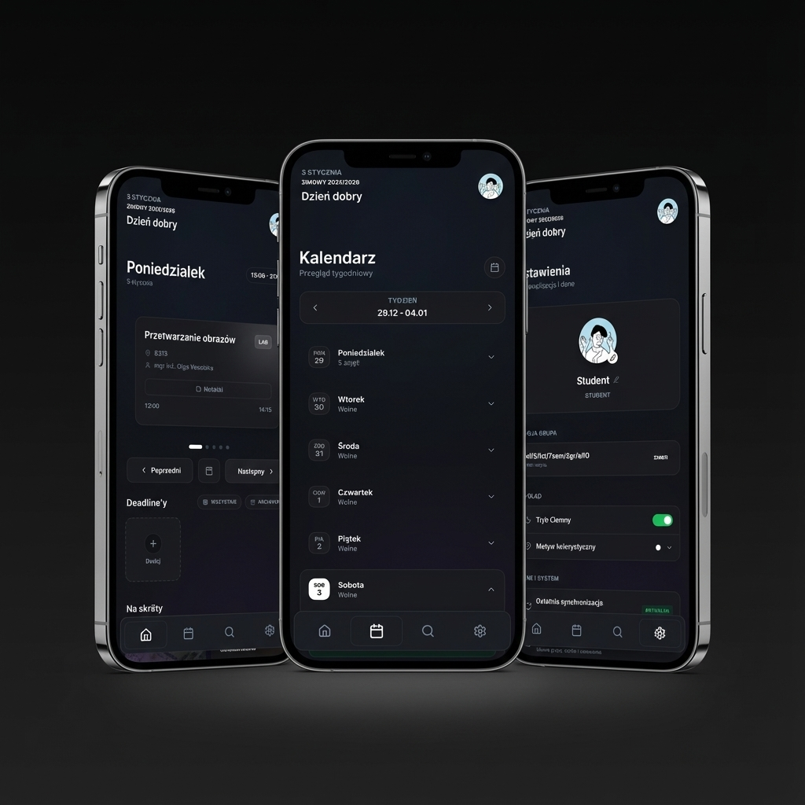

# UniSchedule

Nowoczesna i intuicyjna aplikacja do zarządzania planem zajęć dla studentów UBB. Zaprojektowana z myślą o szybkości, dostępności i natywnym doświadczeniu użytkownika na urządzeniach mobilnych.



## Demo

Pobierz najnowszą wersję na Androida: **[UniSchedule.apk](https://github.com/matikgal/ubb-schedule/releases/latest)**

---

## Instalacja i uruchomienie

```bash
# Klonowanie repozytorium
git clone https://github.com/matikgal/ubb-schedule.git

# Przejście do folderu projektu
cd ubb-schedule

# Instalacja zależności
npm install

# Uruchomienie serwera deweloperskiego
npm run dev
```

Aplikacja będzie dostępna pod adresem `http://localhost:5173`

### Pozostałe komendy

```bash
# Build produkcyjny
npm run build

# Uruchomienie na Androidzie (wymaga Android Studio)
npm run android:run

# Synchronizacja z Android (po buildzie)
npm run android:sync
```

---

## Struktura projektu

```
ubb-schedule/
├── android/                # Pliki natywne Android
├── components/             # Komponenty UI (Layout, Preloader, Modals)
├── context/                # React Context (stan aplikacji)
├── hooks/                  # Custom Hooks
├── pages/                  # Strony aplikacji (Home, Schedule, Settings)
├── public/                 # Pliki statyczne (assets)
├── services/               # Logika biznesowa i integracja z API
├── types/                  # Definicje TypeScript
├── App.tsx                 # Główny komponent aplikacji
├── index.css               # Style globalne TailwindCSS
├── index.tsx               # Punkt wejścia
├── package.json
├── tsconfig.json
└── vite.config.ts
```

---

## Technologie

| Kategoria    | Technologie                                                                                                                                                                                                                                                                                                                                                         |
| ------------ | ------------------------------------------------------------------------------------------------------------------------------------------------------------------------------------------------------------------------------------------------------------------------------------------------------------------------------------------------------------------- |
| **Frontend** |    |
| **Mobile**   |                                                                                                                                                                                                                                                       |
| **Backend**  |                                                                                                                                                                                                                                                          |
| **Build**    |                                                                                                                                                                                                                                                               |

---

## Główne funkcjonalności

- **Native-Feel Mobile App** - pełna integracja z systemem Android
- **Minimalistyczny Design** - przejrzysty interfejs z obsługą trybu ciemnego
- **Wydajność** - błyskawiczne ładowanie i optymalizacja assetów
- **Offline-first** - lokalne zapisywanie preferencji
- **Powiadomienia** - obsługa powiadomień o zajęciach
- **Inteligentne wyszukiwanie** - szybkie filtrowanie grup i wykładowców

---

## Licencja

Projekt udostępniony na licencji MIT. Zobacz plik [LICENSE](LICENSE) po więcej szczegółów.

---

## Kontakt

**Email:** mateusz.galuszka21@gmail.com
<br>
_Stworzone przez Mateusz Gałuszka_
